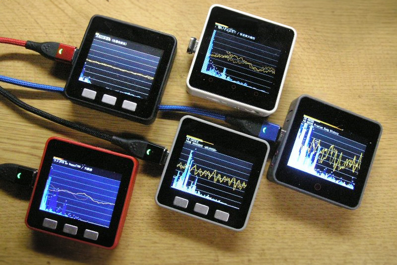

# WebRadio_Japan

### 機能
- [WebRadio_with_ESP8266Audio](https://github.com/m5stack/M5Unified/tree/master/examples/Advanced/WebRadio_with_ESP8266Audio) をベースにして、[JCBAインターネットサイマルラジオ](https://www.jcbasimul.com/) と [radiko(ラジコ)](https://radiko.jp/) と [ListenRadio(リスラジ)](https://listenradio.jp/) と [FM++(FMプラプラ)](https://fmplapla.com/) を聴けるようにしたものを汎用ライブラリにしました。
- 面倒すぎるストリーミングダウンロードやデコードは当ライブラリ側で行いますので、プレイヤーとしてのユーザーインターフェースを各自で作ってください。
- すぐに使える [examples](examples/) も収録し、最も代表的で人気のあるサンプル（それ単体で十分に使える） [WebRadio_Jabasimul / WebRadio_Radiko / WebRadio_ListenRadio / WebRadio_FmPlapla](examples/graphical) に対しては [リリースパッケージ](release/) も用意しましたので、Arduino 環境のない方でも即座にインストールして使用できます。

### ビルドに必要なライブラリ
#### Jcbasimul / Radiko / ListenRadio / FM++ 共通
- [espressif/arduino-esp32](https://github.com/espressif/arduino-esp32)
- [wakwak-koba/ESP8266Audio](https://github.com/wakwak-koba/ESP8266Audio) forked from earlephilhower/ESP8266Audio または [earlephilhower/ESP8266Audio](https://github.com/earlephilhower/ESP8266Audio)
#### Jcbasimul / FM++ のみ
- [Links2004/arduinoWebSockets](https://github.com/Links2004/arduinoWebSockets)
